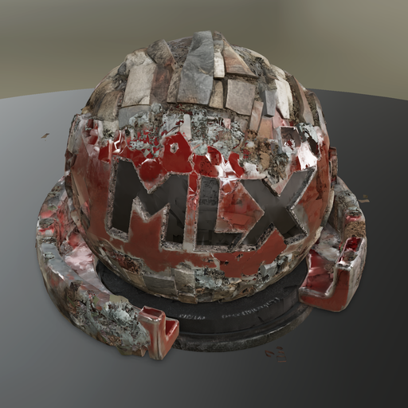
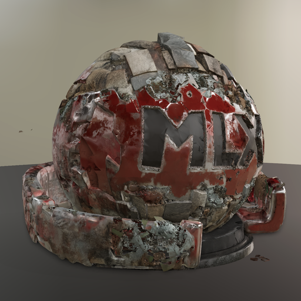
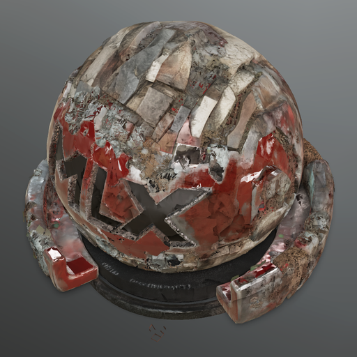
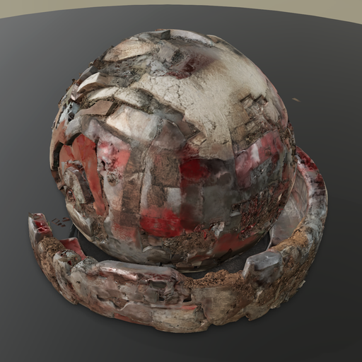

# pixal3d-mlx

MLX-native [Pixal3D](https://github.com/TencentARC/Pixal3D) (SIGGRAPH 2026) inference for Apple Silicon.

Image → textured 3D mesh with PBR materials. No NVIDIA GPU, no PyTorch — pure MLX on Metal.

[Pixal3D](https://github.com/TencentARC/Pixal3D) uses pixel-aligned back-projection conditioning to establish direct pixel-to-3D correspondence, producing dramatically better geometry and texture fidelity than attention-based conditioning alone. This port runs the full pipeline natively on Apple Silicon via [MLX](https://github.com/ml-explore/mlx), including a pure-MLX port of [NAF](https://github.com/valeoai/NAF) (Neural Attention Fields) for feature upsampling.

### Input → Output

<table>
<tr>
<td></td>
<td></td>
<td></td>
<td></td>
<td></td>
</tr>
<tr>
<td align="center"><em>Input</em></td>
<td align="center"><em>Generated</em></td>
<td align="center"><em>Generated</em></td>
<td align="center"><em>Generated</em></td>
<td align="center"><em>Generated</em></td>
</tr>
</table>

*Single image → textured 3D mesh with PBR materials. ~10-21 min on M4 Max depending on resolution. 4096 texture, up to 500K faces. No NVIDIA GPU, no PyTorch — pure MLX on Apple Silicon.*

## Quick start

```bash
git clone https://github.com/lyonsno/pixal3d-mlx.git
cd pixal3d-mlx
uv venv .venv --python python3.12
source .venv/bin/activate
uv pip install -e .

# Hugging Face auth (needed for gated DINOv3 weights):
huggingface-cli login
# Request access: https://huggingface.co/facebook/dinov3-vitl16-pretrain-lvd1689m

# Download model weights (~24 GB for Pixal3D, ~1 GB for DINOv3):
huggingface-cli download TencentARC/Pixal3D
huggingface-cli download facebook/dinov3-vitl16-pretrain-lvd1689m

# Download NAF weights (~3 MB):
mkdir -p weights
curl -L https://github.com/valeoai/NAF/releases/download/model/naf_release.pth -o weights/naf_release.pth
python -c "import torch; from safetensors.torch import save_file; save_file(torch.load('weights/naf_release.pth', map_location='cpu', weights_only=True), 'weights/naf_release.safetensors')"

# Generate:
PYTHONPATH=. python generate_pixal3d.py --image your_image.png --output output.glb

open output.glb
```

## What works now

Full Pixal3D pipeline: image → textured GLB with PBR materials (base color, metallic, roughness).

```bash
# Full pipeline (resolution 1024, highest quality):
PYTHONPATH=. python generate_pixal3d.py --image photo.png --output mesh.glb

# Faster run (resolution 512, ~10 min):
PYTHONPATH=. python generate_pixal3d.py --image photo.png --output mesh.glb --resolution 512

# High-res textures and more geometry:
PYTHONPATH=. python generate_pixal3d.py --image photo.png --output mesh.glb --texture-size 4096 --target-faces 500000

# Resume from checkpoint (skip geometry, redo texture):
PYTHONPATH=. python resume_pixal3d.py --image photo.png --ckpt outputs/ckpt_dir --output mesh.glb
```

### Pipeline

1. **Image conditioning** — DINOv3 ViT-L/16 + NAF feature upsampling + ProjGrid 3D projection
2. **Sparse structure** — 1.3B DiT flow model (12 Euler steps) → 64³ occupancy
3. **LR shape latent** — 1.3B DiT on sparse tokens (512 model)
4. **Upsample** — decoder subdivision → HR coordinates
5. **HR shape latent** — 1.3B DiT on sparse tokens (1024 model)
6. **Shape decode + mesh extraction** — sparse UNet decoder → dual-grid mesh
7. **Texture latent + decode** — 1.3B DiT → per-voxel PBR attributes
8. **UV unwrap + texture bake** — xatlas + trilinear voxel sampling + seam inpaint → GLB

### Performance (M4 Max, 128 GB)

| Resolution | Tokens | Time | Peak GPU | Texture |
|-----------|--------|------|----------|---------|
| 512 | ~6K | ~10 min | ~20 GB | 2048 |
| 1024 | ~15K | ~21 min | ~33 GB | 4096 |

Requires Apple Silicon with 64 GB unified memory for resolution 1024.
Resolution 512 may fit in 32 GB.

### Key features

- **Pixel-aligned projection conditioning** — explicit pixel-to-voxel spatial correspondence, not loose attention
- **NAF upsampling** — pure MLX port of [valeoai/NAF](https://github.com/valeoai/NAF) with windowed neighborhood attention (no natten CUDA dependency)
- **No SDPA cliff** — MLX Flash Attention handles 26K+ tokens where PyTorch MPS silently breaks at 18K
- **Checkpoint/resume** — save intermediate results, resume from shape latent to skip geometry stages
- **Aggressive memory cleanup** — `mx.metal.clear_cache()` between stages, model offloading
- **47 tests** — projection modules, flow models, weight loading, NAF (neighborhood attention, RoPE, encoder, cross-attention, weight loader)

## Architecture

```
trellmlx/
├── models/
│   ├── pixal3d_flow.py          # Pixal3D SS + SLat flow models with ProjectAttention
│   ├── dinov3_proj.py           # DINOv3 + NAF + ProjGrid feature extraction
│   ├── naf.py                   # NAF feature upsampler (windowed neighborhood attention)
│   ├── naf_loader.py            # NAF weight loader
│   ├── sparse_structure_flow.py # Base TRELLIS.2 SS flow model
│   ├── slat_flow.py             # Base TRELLIS.2 SLat flow model
│   ├── shape_slat_decoder.py    # Sparse UNet decoder
│   ├── sparse_structure_decoder.py
│   └── dinov3.py                # DINOv3 ViT-L/16
├── modules/
│   ├── proj_grid.py             # 3D grid projection + bilinear sampling
│   ├── proj_attention.py        # ProjectAttention (cross-attn + proj_linear)
│   ├── attention.py             # MLX Flash Attention + MultiHeadRMSNorm
│   ├── rope.py                  # 3D Rotary Position Embedding
│   ├── norm.py                  # LayerNorm32
│   └── sparse_conv.py           # Submanifold sparse 3D convolution
├── mesh_extract.py              # Dual-grid mesh extraction
├── mesh_cleanup.py              # Dedup, non-manifold repair, hole fill, normal fix
├── texture_bake.py              # UV unwrap + MLX GPU rasterization + voxel sampling
├── samplers.py                  # Flow Euler sampler with CFG + guidance interval
├── weight_loader.py             # Safetensors loader (key remap, bf16→fp16)
└── checkpoint.py                # Stage checkpoint save/load
```

## How it differs from upstream Pixal3D

| | Upstream (CUDA) | This port (MLX) |
|---|---|---|
| Runtime | PyTorch + CUDA + natten + nvdiffrast + o_voxel | Pure MLX + numpy |
| Attention | Flash Attention 3 (CUDA) | MLX Flash Attention (Metal) |
| NAF | natten CUDA kernels | Windowed gather with dilation (pure MLX) |
| Sparse conv | flex_gemm CUDA | Gather-scatter sparse conv (MLX) |
| Mesh extraction | o_voxel CUDA + nvdiffrast | numpy dual-grid + xatlas + MLX GPU rasterizer |
| Install | Multiple compiled CUDA/C++ packages | `pip install -e .` |

## Credits

- [Pixal3D](https://github.com/TencentARC/Pixal3D) by TencentARC — the model and paper (SIGGRAPH 2026)
- [TRELLIS.2](https://github.com/microsoft/TRELLIS.2) by Microsoft Research — the backbone architecture
- [NAF](https://github.com/valeoai/NAF) by Valeo.ai — Neural Attention Fields feature upsampler
- [Pixal3D-mac](https://github.com/pawel-mazurkiewicz/Pixal3D-mac) by Pawel Mazurkiewicz — first Mac port (PyTorch MPS + Metal kernels)
- [trellis2-apple](https://github.com/pedronaugusto/trellis2-apple) by Pedro Naugusto — MLX backend + Metal GPU packages
- [trellis-mac](https://github.com/shivampkumar/trellis-mac) by Shivam Kumar — proved Mac viability for TRELLIS
- [MLX](https://github.com/ml-explore/mlx) by Apple — the framework

## License

MIT (porting code). Upstream model weights are subject to their own licenses.
